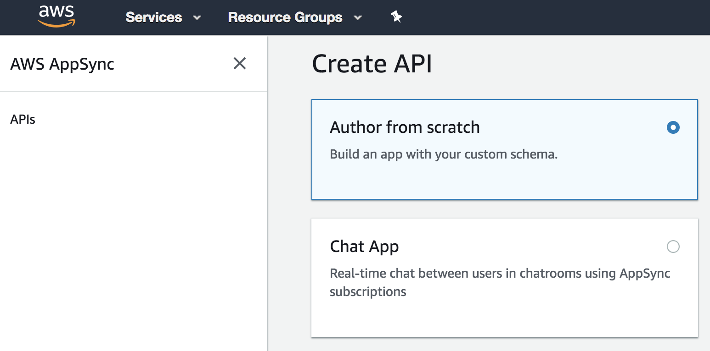
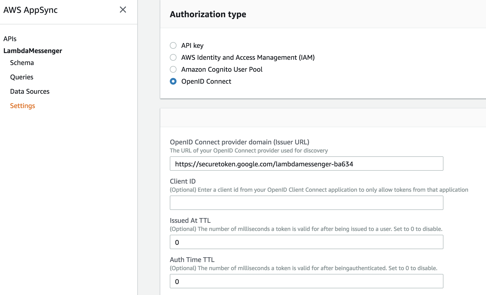
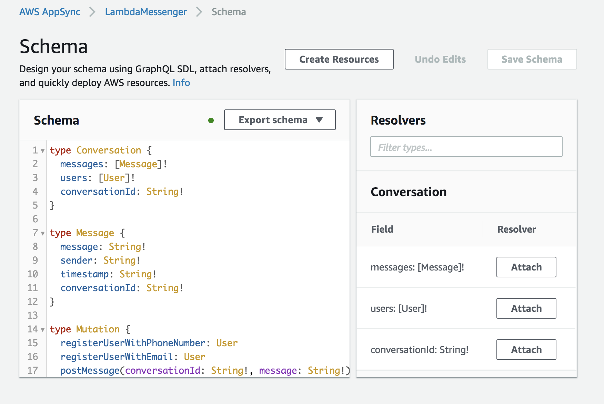
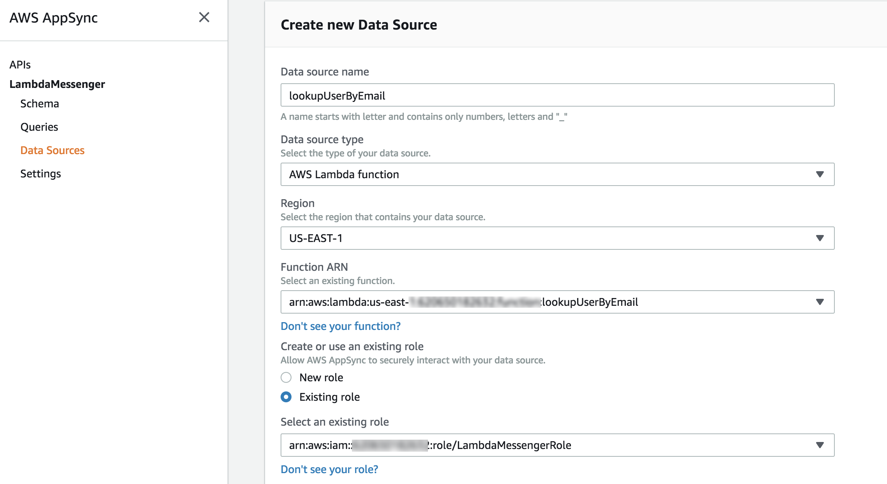

# Creating an AWS AppSync Project

AWS AppSync provides a GraphQL service for the LambdaMessenger project. With AppSync, realtime message updates can be retrieved from clients using GraphQL [Subscriptions](https://docs.aws.amazon.com/appsync/latest/devguide/real-time-data.html).

1. In the AWS Admin console, navigate to the AppSync service and create a new API. Select "Author from Scratch" to get started.
	
2. Under settings, set the authorization type as "OpenID Connect". The OpenID connect provider should be set using the provider name for your Firebase project. 
    
3. Create your schema. Copy the `config/aws-appsync-schema.graphql` file into the schema section of the AppSync console.
    
4. Configure your data sources. Create the following data sources (one per each Lambda Function). 
	* getConversation
	* getConversationHistory
	* initiateConversation
	* lookupUserByEmail
	* lookupUserByPhoneNumber
	* postMessage
	* registerUserWithEmail
	* registerUserWithPhoneNumber
	
	DataSource creation should look like this:
	
	
5. Configure your resolvers. You only need to set resolvers for your Queries and Mutations. Copy and paste the JSON below for each Query and Mutation:

    Request mapping templates:

	```json
	{
	    "version" : "2017-02-28",
	    "operation": "Invoke",
	    "payload": {
	    	"user" : {
	        	"userId": $utils.toJson($context.identity.claims.sub),
	        	"email" : $utils.toJson($context.identity.claims.email),
	        	"phoneNumber" : $utils.toJson($context.identity.claims.phone_number),
	            "displayName" : $utils.toJson($context.identity.claims.name),
	        },
	        "arguments": $utils.toJson($context.args)
	    }
	}
	```
	
	Response mapping templates:
	
	```json
	$util.toJson($context.result)
	```


