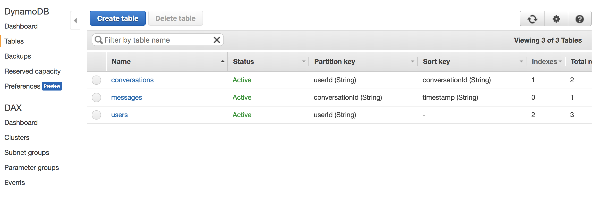

# Creating DynamoDB Tables

LambdaMessenger using three tables:

* Users
	- userId (partition key)
	- displayName (Required)
	- email (Optional)
	- phoneNumber (Optional)
	- Global Secondary indexes on email and phoneNumber to allow reverse lookups
* Messages
	- conversationId (partition key)
	- timestamp (sort key)
	- message (required - the message contents)
	- sender (required - the userId of the sender)
* Conversations
	- userId (partition key)
	- conversationId (sort key)
	- Global Secondary indexes on conversationId to allow reverse lookups

## Creating the DynamoDB tables

Run `node utils/dynamodb.js` to generate the DynamoDB tables.

When the script is complete, log into the AWS Console and confirm your tables are initialized:

