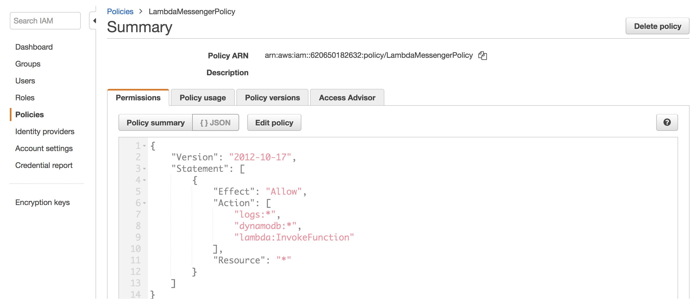
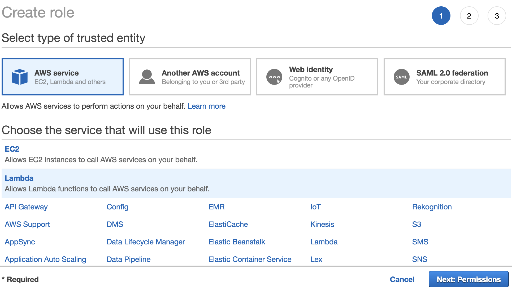
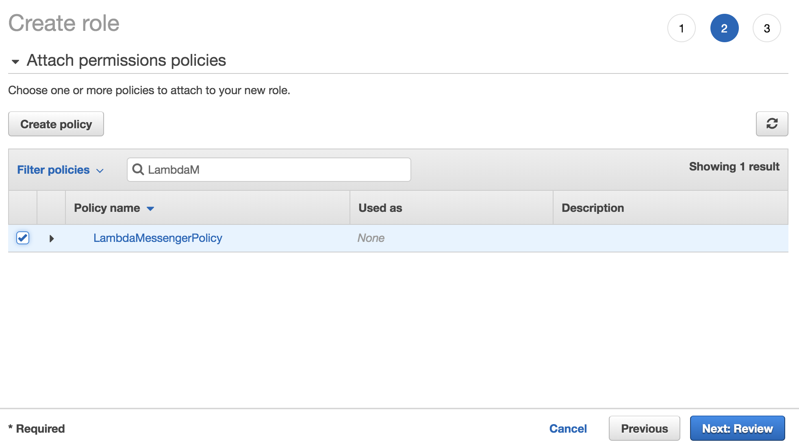
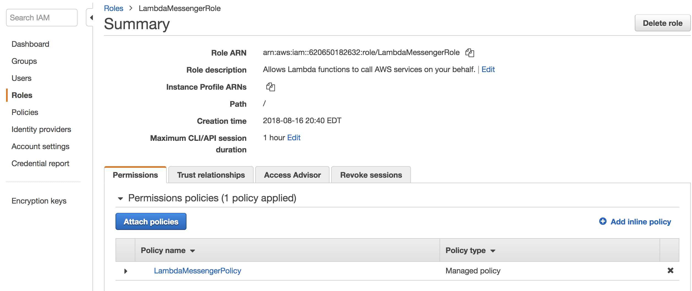

# Creating a new AWS IAM Role

Follow the following steps to create a new AWS IAM role for the LambdaMessenger project. A sample policy is provided below. (Note, for a production-quality app, these permissions may need to be refined to make them more restrictive.)

1. In the AWS Console, select the IAM Service
2. Select "Policies" from the menu and "Create policy"
3. Enter the policy below using the JSON editor:

    ```json
	{
	    "Version": "2012-10-17",
	    "Statement": [
	        {
	            "Effect": "Allow",
	            "Action": [
	                "logs:*",
	                "dynamodb:*",
	                "lambda:InvokeFunction"
	            ],
	            "Resource": "*"
	        }
	    ]
	}
	```

4. Enter a Trust policy that allows both AppSync and Lambda functions to interface with one another

	```json
	{
	  "Version": "2012-10-17",
	  "Statement": [
	    {
	      "Effect": "Allow",
	      "Principal": {
	        "Service": "lambda.amazonaws.com"
	      },
	      "Action": "sts:AssumeRole"
	    },
	    {
	      "Effect": "Allow",
	      "Principal": {
	        "Service": "appsync.amazonaws.com"
	      },
	      "Action": "sts:AssumeRole"
	    }
	  ]
	}
	```
5. Name your policy and save it. After saving it, your policy should look like this:
   
6. Next, select "Roles" from the menu and "Create role". In the section labeled "Choose service that will use this role", select "Lambda" and then click "Next"
	
7. Attach the policy you created to the role:
   
8. Name the role and save it. When you're done, your new AIM role should look like this:
   
9. Take note of the IAM role ARN which is in a format like: `arn:aws:iam::<Account ID>:role/<Role Name>`. This role needs to be added to your `config/config.json` file.
