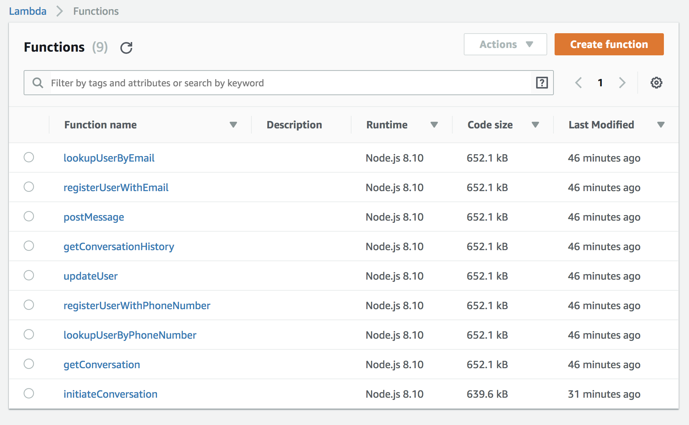

# Creating AWS Lambda Functions

1. Create an S3 bucket to store your node packages. You can do this using the AWS CLI: `aws s3 mb s3://<LAMBDA_PACKAGE_S3_BUCKET>`. Update your `config.json` with the name of the S3 bucket you've created.
2. Test your APIs with `npx runjs test tests/apiTests.js`
3. Deploy your Lambda functions with `npx runjs all && npm install`. This will package your javascript into a bundle, remove all dev dependencies from node_modules, upload the node package to S3, and deploy the Lambda functions using Cloudformation. (To minimize the deployment package, all npm modules used for development are removed, so an `npm install` needs to be run after deployment)
4. Validate your Lambda functions are deployed in AWS
5. Test your lambda functions with `npx runjs test/lambdaTests.js`

	