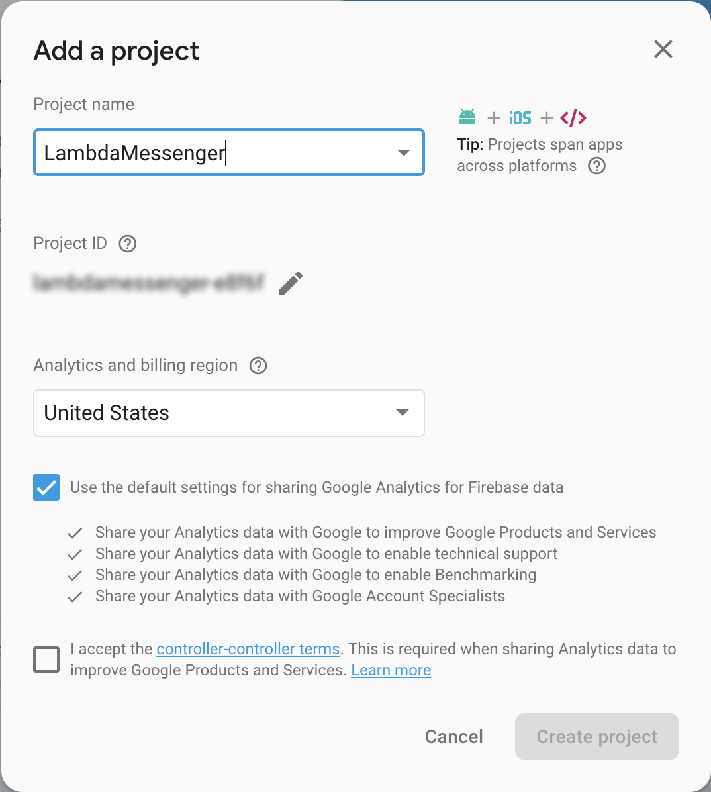

# Configuring Firebase for LambdaMessenger

## Creating a new Firebase Project
Firebase is used to authenticate users via phone number and email. To configure Firebase, create an account at [firebase.google.com](https://firebase.google.com/) and follow the steps below.

1. Create a new Firebase project
	
2. Create a webapp. When presented with the screen below, save the configuration information in the `config/firebase-config.js` file. (See the `config/firebase-config.sample.js` as a reference)
    
3. Enable phone an email authentication. (You can configure phone numbers here for testing purposes)
	
4. In order to run several unit tests, a Firebase admin private key is required. Download this from the Service Accounts section of the Firebase admin console. Rename this file `serviceAccountKey.json` and place it in the `config` directory.
   
   
## Determining your OpenID Connect URL
   
When you're finished configuring Firebase, you should have both the `config/firebase-config.js` and `config/serviceAccountKey.json` files in place. Take note of your project ID. This is used to configure your OPENID Connect URL which AWS AppSync will used to authenticate requests. The OpenID Connect URL is:

`https://securetoken.google.com/PROJECT_ID`

Where PROJECT_ID is your Firebase project ID.

## Validating your OpenID Connect URL

The OpenID Connect URL (without any additional query string parameters) may not load in a web browser. To confirm it is a valid URL, append the following `.well-known/openid-configuration` to it and you should be able to load the URL. For instance: 

`https://securetoken.google.com/PROJECT_ID/.well-known/openid-configuration`

⚠️ Remember, your OpenID Connect URL is simply: `https://securetoken.google.com/PROJECT_ID` without any additional query string parameters.
